# Appstock SDK iOS - Mediation - AdMob

In order to integrate Appstock AdMob Adapter into your app, add the following lines to your Podfile:

```bash
pod 'AppstockSDK', '1.1.1'
pod 'GoogleMobileAdsAppstockAdapter', '1.1.1'
```

**Warning**: The `GADMobileAds.sharedInstance().start()` should be called in the adapters bundle, otherwise, GMA SDK won’t load the ads with error: 
```bash
SDK tried to perform a networking task before being initialized.
```

To avoid the error add the following line to your app right after initialization of GMA SDK:

```swift
AppstockGADMediationAdapterInitializer.start()
```

In order to add Appstock to the waterfall, you need to create a custom event in your AdMob account and then add this event to the respective mediation groups.

To create a Appstock custom event, follow the instructions:

1. Sign in to your AdMob account at https://apps.admob.com.
2. Click **Mediation** in the sidebar.

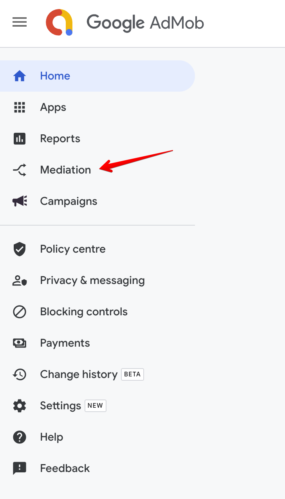

3. Click the **Waterfall** sources tab. 


4. Click **Custom Event**.

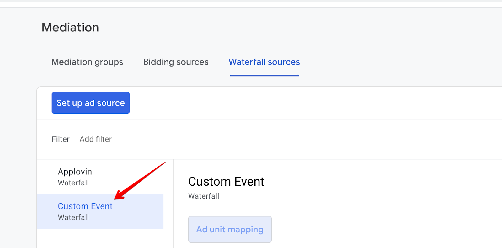

5. Find your app in the list and click on it to expand.

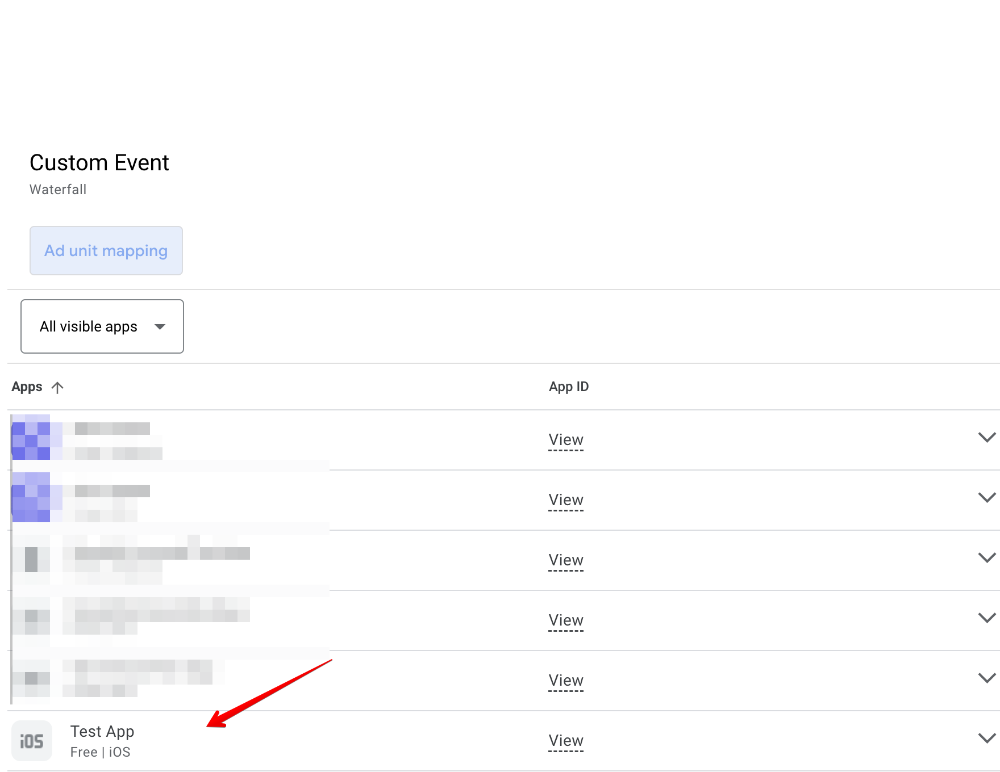

6. Click **Add mapping**.

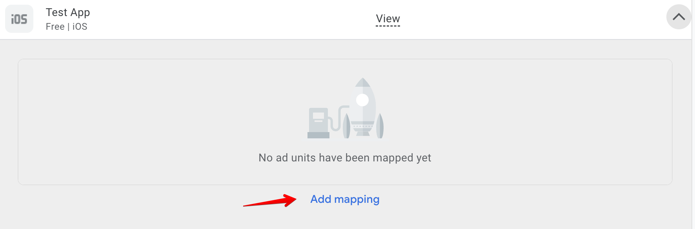

7. Click **Add mapping**. To include multiple custom events, you’ll need to set up [additional mappings](https://support.google.com/admob/answer/13395411#manage).

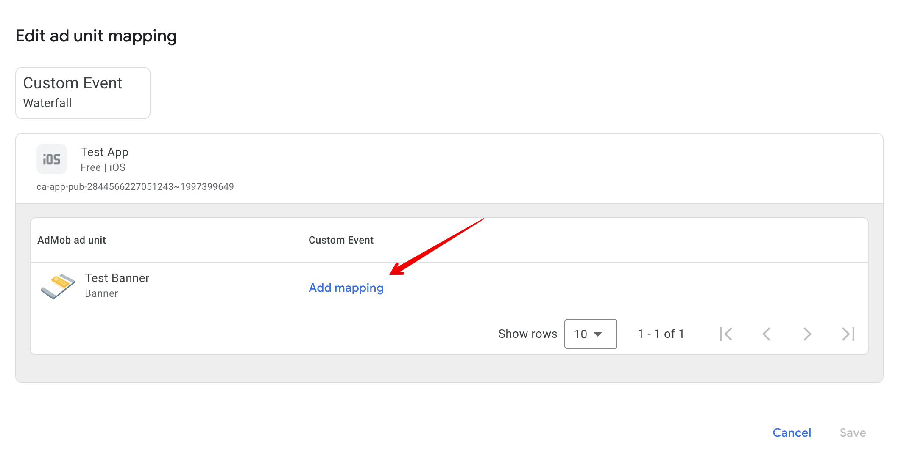

8. Add the mapping details, including a mapping name. Enter a class name (required) and a parameter (optional) for each ad unit. Typically, the optional parameter contains a JSON that contains IDs (placement ID, endpoint ID) that will be used by the custom event to load ads.

Parameters:

- **placement_id** - unique identifier generated on the platform's UI;
- **endpoint_id** - unique identifier generated on the platform's UI;
- **sizes** - array of the ad sizes. You can specify width in `w` field and height in `h` field. Make sure you've provided both width and height values;
- **ad_formats** - array of the ad formats. You can pass only `banner` and `video` ad formats. Other values will be ignored. Note that the multiformat request is supported only for interstitial ads.

```json
{
  "placement_id": “4”,
  "sizes": [
    {
      "w": 729,
      "h": 90
    }
  ],
  "ad_formats": ["video"]
}
```

```json
{
  "endpoint_id": "1",
  "sizes": [
    {
      "w": 320,
      "h": 50
    },
    {
      "w": 300,
      "h": 250
    },
  ],
  "ad_formats": ["banner"]
}
```


9. Click **Save**.

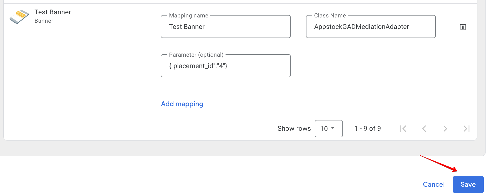

After you’ve finished setting up your custom event, you’re ready to add it to a mediation group. To add your ad source to an existing mediation group:

1. Sign in to your AdMob account at https://apps.admob.com.
2. Click **Mediation** in the sidebar.


3. In the **Mediation group** tab, click the name of the mediation group to which you're adding the ad source. 

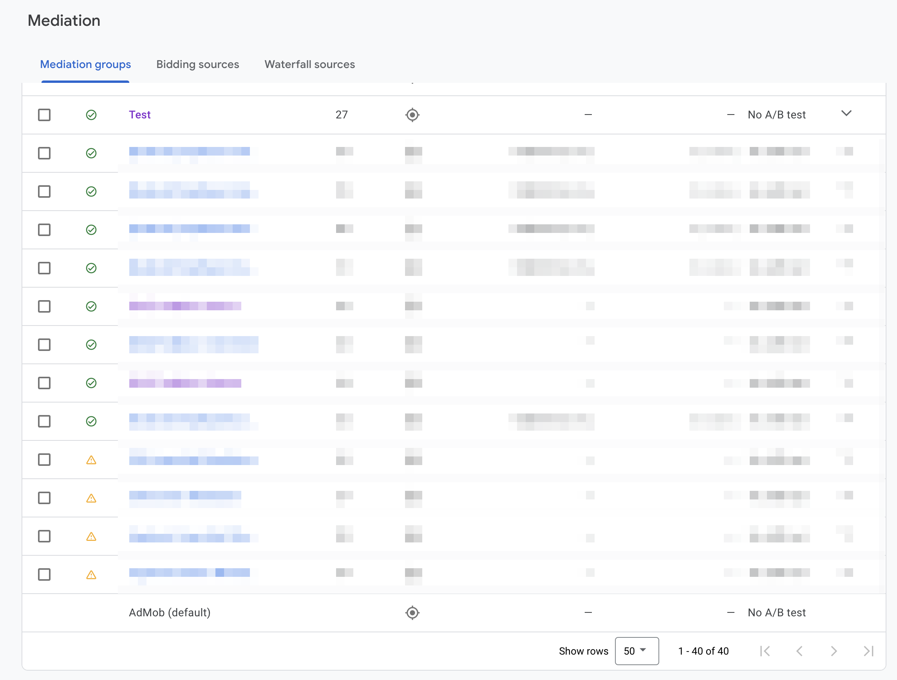

4. In the Waterfall ad sources table, click **Add custom event**.

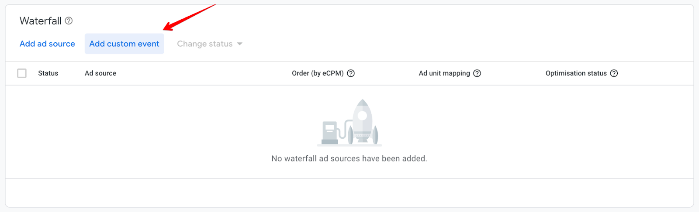

5. Enter a descriptive label for the event. Enter a manual eCPM to use for this custom event. The eCPM will be used to dynamically position the event in the mediation waterfall where it will compete with other ad sources to fill ad requests.

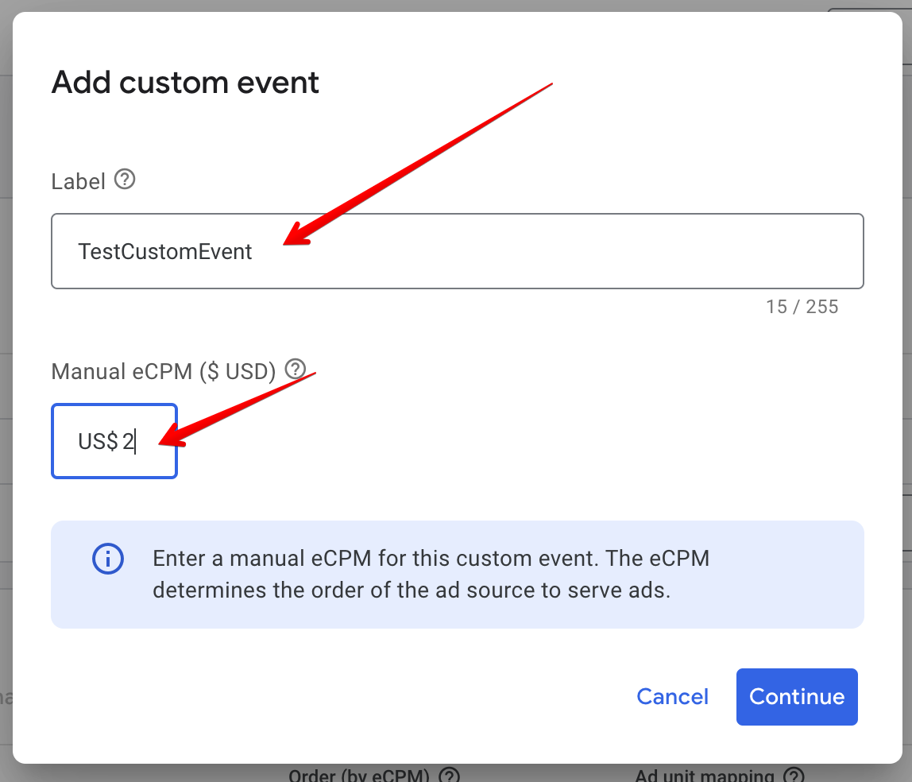

6. Click **Continue**.

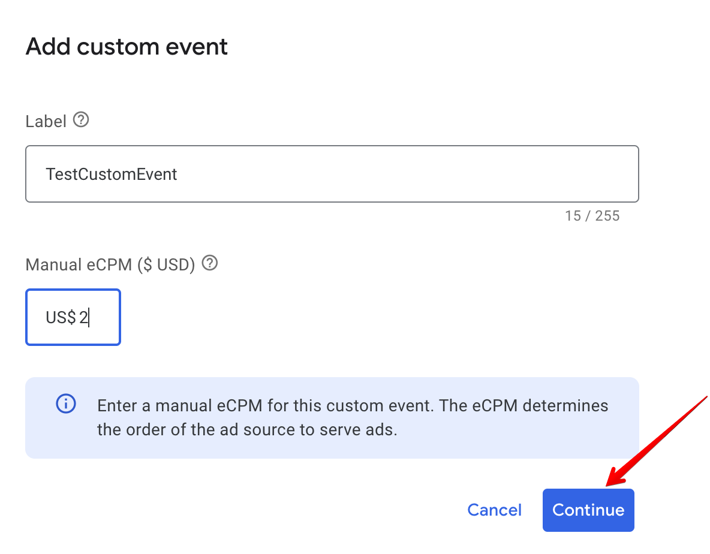

7. Select an existing mapping to use for this custom event or click Add mapping to set up a new mapping. To use multiple custom events, you’ll have to [create an additional mapping](https://support.google.com/admob/answer/13395411#manage) for each custom event.

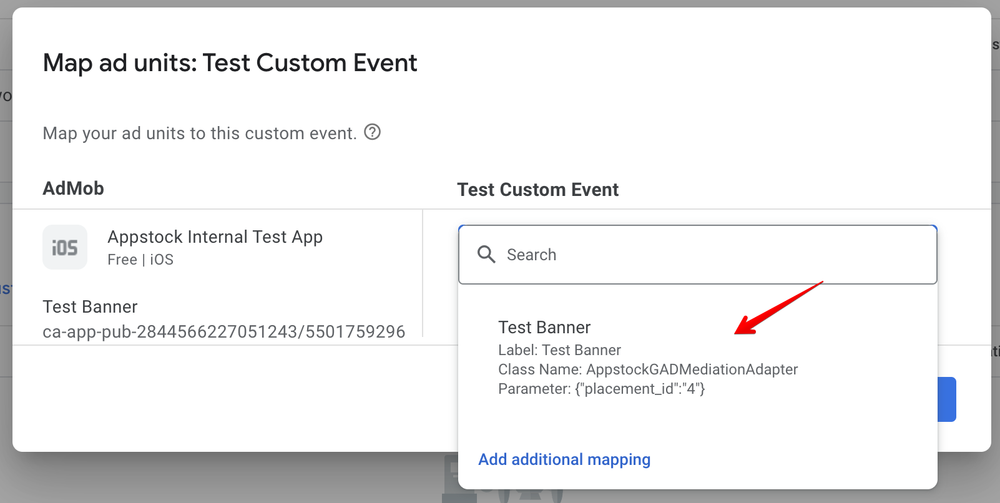

8. Click **Done**.

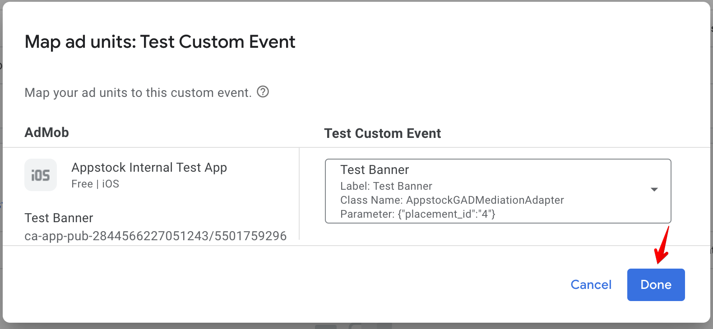

9. Click **Save**. The mediation group will be saved.

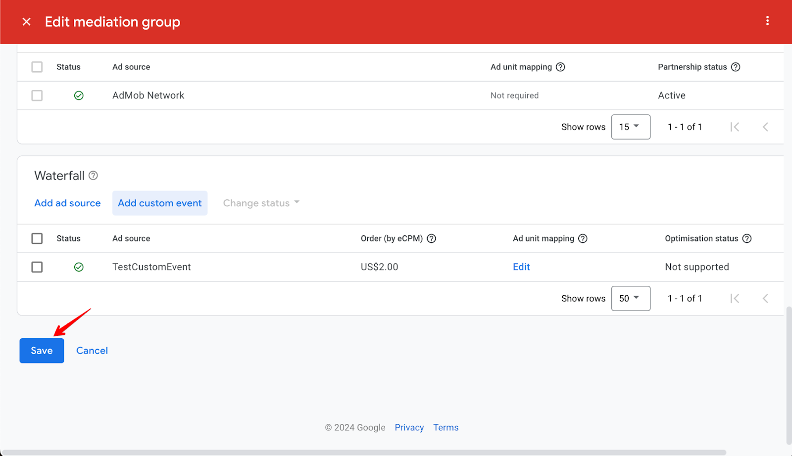

## Native Ads

If you integrate native ads, you should pass the native assets through Google Mobile Ads SDK (`GADAdLoader`) to the Appstock Adapter using `AppstockGADExtras` class in your app code:

*Swift*

```swift
private func loadAd() {
    // 1. Create a GADAdLoader
    adLoader = GADAdLoader(
        adUnitID: adUnitId,
        rootViewController: self,
        adTypes: [.native],
        options: []
    )
     
    // 2. Configure the GADAdLoader
    adLoader?.delegate = self
     
    // 3. Configure the native parameters
    let image = AppstockNativeAssetImage(minimumWidth: 200, 
    minimumHeight: 50, required: true)
    image.type = .Main
     
    let icon = AppstockNativeAssetImage(minimumWidth: 20, 
    minimumHeight: 20, required: true)
    icon.type = .Icon
     
    let title = AppstockNativeAssetTitle(length: 90, required: true)
    let body = AppstockNativeAssetData(type: .description, 
    required: true)
    let cta = AppstockNativeAssetData(type: .ctatext, required: true)
    let sponsored = AppstockNativeAssetData(type: .sponsored, 
    required: true)
     
    let parameters = AppstockNativeParameters()
    parameters.assets = [title, icon, image, sponsored, body, cta]
     
    let eventTracker = AppstockNativeEventTracker(
        event: .Impression,
        methods: [.Image, .js]
    )
     
    parameters.eventtrackers = [eventTracker]
    parameters.context = .Social
    parameters.placementType = .FeedContent
    parameters.contextSubType = .Social
     
    // 4. Create a AppstockGADExtras
    let extras = AppstockGADExtras(nativeParameters: parameters)
     
    // 5. Create a GADRequest
    let request = GADRequest()
     
    // 6. Register the AppstockGADExtras
    request.register(extras)
     
    // 7. Load the ad
    adLoader?.load(request)
}
```

*Objective-C*

```objc
- (void)loadAd {
    // 1. Create a GADAdLoader
    self.adLoader = [[GADAdLoader alloc] initWithAdUnitID:self.adUnitId
    rootViewController:self adTypes:@[GADAdLoaderAdTypeNative]
    options:@[]];
    
    // 2. Configure the GADAdLoader
    self.adLoader.delegate = self;
    
    // 3. Configure the native parameters
    AppstockNativeAssetImage *image = [
        [AppstockNativeAssetImage alloc]
        initWithMinimumWidth:200
        minimumHeight:200
        required:true
    ];
    
    image.type = AppstockImageAsset.Main;
    
    AppstockNativeAssetImage *icon = [
        [AppstockNativeAssetImage alloc]
        initWithMinimumWidth:20
        minimumHeight:20
        required:true
    ];
    
    icon.type = AppstockImageAsset.Icon;
    
    AppstockNativeAssetTitle *title = [
        [AppstockNativeAssetTitle alloc]
        initWithLength:90
        required:true
    ];
    
    AppstockNativeAssetData *body = [
        [AppstockNativeAssetData alloc]
        initWithType:AppstockDataAssetDescription
        required:true
    ];
    
    AppstockNativeAssetData *cta = [
        [AppstockNativeAssetData alloc]
        initWithType:AppstockDataAssetCtatext
        required:true
    ];
    
    AppstockNativeAssetData *sponsored = [
        [AppstockNativeAssetData alloc]
        initWithType:AppstockDataAssetSponsored
        required:true
    ];
    
    AppstockNativeParameters * parameters = 
    [AppstockNativeParameters new];
    parameters.assets = @[title, icon, image, sponsored, body, cta];
    
    AppstockNativeEventTracker * eventTracker = [
        [AppstockNativeEventTracker alloc]
        initWithEvent:AppstockEventType.Impression
        methods:@[AppstockEventTracking.Image, AppstockEventTracking.js]
    ];
    
    parameters.eventtrackers = @[eventTracker];
    parameters.context = AppstockContextType.Social;
    parameters.placementType = AppstockPlacementType.FeedContent;
    parameters.contextSubType = AppstockContextSubType.Social;
    
    // 4. Create a AppstockGADExtras
    AppstockGADExtras * extras = [[AppstockGADExtras alloc] 
    initWithNativeParameters:parameters];
    
    // 5. Create a GADRequest
    GADRequest * request = [GADRequest new];
    
    // 6. Register the AppstockGADExtras
    [request registerAdNetworkExtras:extras];
    
    // 7. Load the ad
    [self.adLoader loadRequest:request];
}
```

Display the ad as described in [AdMob docs](https://developers.google.com/admob/ios/native/advanced):

*Swift*

```swift
func adLoader(_ adLoader: GADAdLoader, didReceive nativeAd: GADNativeAd) {
    // Set GADNativeAd in GADNativeAdView
    admobNativeView.nativeAd = nativeAd
    
    // 8. Render the ad
    titleLabel.text = nativeAd.headline
    bodyLabel.text = nativeAd.body
    
    mainImageView.setImage(
        from: nativeAd.images?.last?.imageURL?.absoluteString,
        placeholder: UIImage(systemName: "photo.artframe")
    )
    
    iconView.setImage(
        from: nativeAd.icon?.imageURL?.absoluteString,
        placeholder: UIImage(systemName: "photo.artframe")
    )
    
    callToActionButton.setTitle(nativeAd.callToAction, for: .normal)
    sponsoredLabel.text = nativeAd.advertiser
}
```

*Objective-C*

```objc
- (void)adLoader:(GADAdLoader *)adLoader didReceiveNativeAd:(GADNativeAd *)nativeAd {
    // Set GADNativeAd in GADNativeAdView
    self.admobNativeView.nativeAd = nativeAd;
    
    self.titleLabel.text = nativeAd.headline;
    self.bodyLabel.text = nativeAd.body;
    self.sponsoredLabel.text = nativeAd.advertiser;
    
    [self.mainImageView setImageFromURLString:nativeAd.images.lastObject.imageURL.absoluteString
                                      placeholder:[UIImage systemImageNamed:@"photo.artframe"]];
    [self.iconView setImageFromURLString:nativeAd.icon.imageURL.absoluteString
                                      placeholder:[UIImage systemImageNamed:@"photo.artframe"]];
    [self.callToActionButton setTitle:nativeAd.callToAction forState:UIControlStateNormal];
}
```

