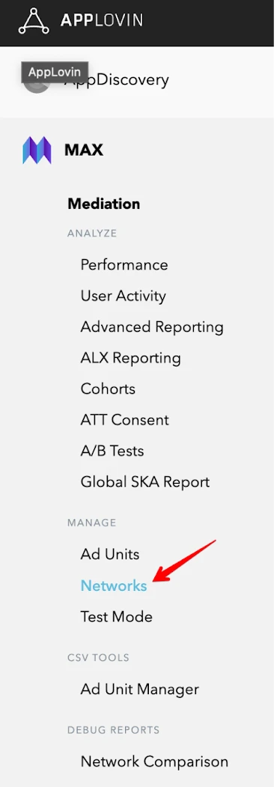
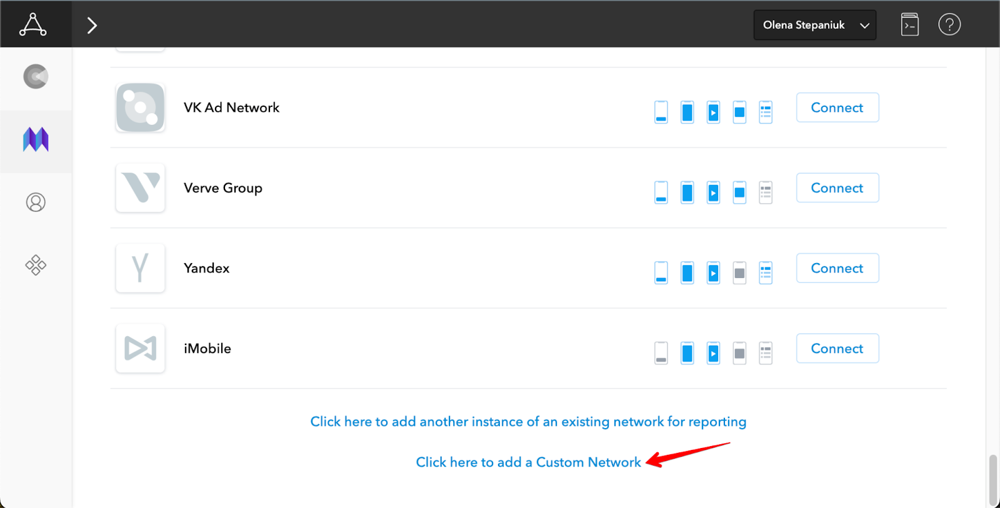
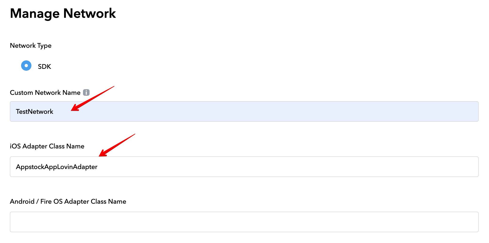
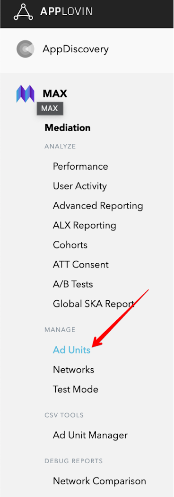
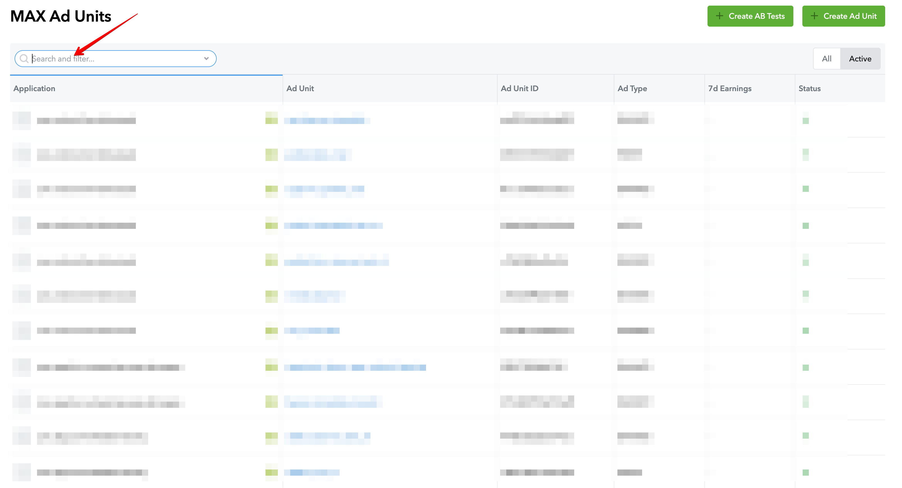
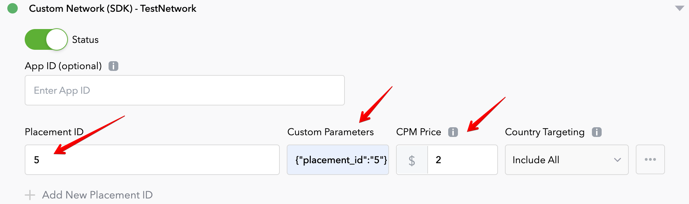

# Appstock SDK iOS - Mediation - AppLovin

In order to integrate Appstock AppLovin MAX Adapter into your app, add following lines to your Podfile:

```bash
pod 'AppstockSDK', '1.1.1'
pod 'AppstockAppLovinMAXAdapter', '1.1.1'
```

To integrate the Appstock SDK into your AppLovin monetization stack, you should enable a Appstock SDK ad network and add it to the respective ad units.

1. In the MAX Dashboard, select [MAX > Mediation > Manage > Networks](https://dash.applovin.com/o/mediation/networks/).



2. Click **Click here to add a Custom Network at the bottom of the page**. The **Create Custom Network** page appears.

3. Add the information about your custom network:
- **Network Type** : Choose **SDK**.
- **Name** : Appstock.
- **iOS Adapter Class Name** : AppstockAppLovinAdapter




4. Open [MAX > Mediation > Manage > Ad Units](https://dash.applovin.com/o/mediation/ad_units/) in the MAX dashboard.



5. Search and select an ad unit for which you want to add the custom SDK network that you created in the previous step.



6. Select which custom network you want to enable and enter the information for each placement. Refer to the network documentation to see what values you need to set for the **App ID**, **Placement ID**, and **Custom Parameters**.



Typically, the custom parameters field should contain a JSON that contains IDs (placement ID, endpoint ID) that will be used to load ads.

Parameters:

- **placement_id** - unique identifier generated on the platform's UI;
- **endpoint_id** - unique identifier generated on the platform's UI;
- **sizes** - array of the ad sizes. You can specify width in `w` field and height in `h` field. Make sure you've provided both width and height values;
- **ad_formats** - array of the ad formats. You can pass only `banner` and `video` ad formats. Other values will be ignored. Note that the multiformat request is supported only for interstitial ads.

Example: 

```json
{
  "placement_id": “4”,
  "sizes": [
    {
      "w": 729,
      "h": 90
    }
  ],
  "ad_formats": ["video"]
}
```

```json
{
  "endpoint_id": "1",
  "sizes": [
    {
      "w": 320,
      "h": 50
    },
    {
      "w": 300,
      "h": 250
    },
  ],
  "ad_formats": ["banner"]
}
```

7. Save ad unit.

## Native Ads

If you integrate native ads, you should pass the native assets through AppLovin MAX SDK (`MANativeAdLoader`) to the Appstock Adapter using `AppstockAppLovinExtras` class in your app code:

*Swift*

```swift
private func loadAd() {
    // 1. Create a MANativeAdLoader
    nativeAdLoader = MANativeAdLoader(adUnitIdentifier: adUnitId)
     
    // 2. Configure the MANativeAdLoader
    nativeAdLoader.nativeAdDelegate = self
     
    // 3. Configure the native parameters
    let image = AppstockNativeAssetImage(minimumWidth: 200, 
    minimumHeight: 50, required: true)
    image.type = .Main
     
    let icon = AppstockNativeAssetImage(minimumWidth: 20, 
    minimumHeight: 20, required: true)
    icon.type = .Icon
     
    let title = AppstockNativeAssetTitle(length: 90, required: true)
    let body = AppstockNativeAssetData(type: .description, 
    required: true)
    let cta = AppstockNativeAssetData(type: .ctatext, 
    required: true)
    let sponsored = AppstockNativeAssetData(type: .sponsored, 
    required: true)
     
    let parameters = AppstockNativeParameters()
    parameters.assets = [title, icon, image, sponsored, body, cta]
     
    let eventTracker = AppstockNativeEventTracker(
        event: .Impression,
        methods: [.Image, .js]
    )
     
    parameters.eventtrackers = [eventTracker]
    parameters.context = .Social
    parameters.placementType = .FeedContent
    parameters.contextSubType = .Social
     
    // 4. Create a AppstockAppLovinExtras
    let extras = AppstockAppLovinExtras(nativeParameters: parameters)
     
    // 5. Set local extra parameter
    nativeAdLoader.setLocalExtraParameterForKey(
    AppstockAppLovinExtras.key, value: extras)
     
    // 6. Load the ad
    nativeAdLoader.loadAd(into: maNativeAdView)
}
```

*Objective-C*

```objc
- (void)loadAd {
    // 1. Create a MANativeAdLoader
    self.nativeAdLoader = [[MANativeAdLoader alloc] 
    initWithAdUnitIdentifier:self.adUnitId];
    
    // 2. Configure the MANativeAdLoader
    self.nativeAdLoader.nativeAdDelegate = self;
    
    // 3. Configure the native parameters
    AppstockNativeAssetImage *image = [
        [AppstockNativeAssetImage alloc]
        initWithMinimumWidth:200
        minimumHeight:200
        required:true
    ];
    
    image.type = AppstockImageAsset.Main;
    
    AppstockNativeAssetImage *icon = [
        [AppstockNativeAssetImage alloc]
        initWithMinimumWidth:20
        minimumHeight:20
        required:true
    ];
    
    icon.type = AppstockImageAsset.Icon;
    
    AppstockNativeAssetTitle *title = [
        [AppstockNativeAssetTitle alloc]
        initWithLength:90
        required:true
    ];
    
    AppstockNativeAssetData *body = [
        [AppstockNativeAssetData alloc]
        initWithType:AppstockDataAssetDescription
        required:true
    ];
    
    AppstockNativeAssetData *cta = [
        [AppstockNativeAssetData alloc]
        initWithType:AppstockDataAssetCtatext
        required:true
    ];
    
    AppstockNativeAssetData *sponsored = [
        [AppstockNativeAssetData alloc]
        initWithType:AppstockDataAssetSponsored
        required:true
    ];
    
    AppstockNativeParameters * parameters = 
    [AppstockNativeParameters new];
    parameters.assets = @[title, icon, image, sponsored, body, cta];
    
    AppstockNativeEventTracker * eventTracker = [
        [AppstockNativeEventTracker alloc]
        initWithEvent:AppstockEventType.Impression
        methods:@[AppstockEventTracking.Image, AppstockEventTracking.js]
    ];
    
    parameters.eventtrackers = @[eventTracker];
    parameters.context = AppstockContextType.Social;
    parameters.placementType = AppstockPlacementType.FeedContent;
    parameters.contextSubType = AppstockContextSubType.Social;
    
    // 4. Create a AppstockAppLovinExtras
    AppstockAppLovinExtras * extras = [[AppstockAppLovinExtras alloc] 
    initWithNativeParameters: parameters];
    
    // 5. Set local extra parameter
    [self.nativeAdLoader 
    setLocalExtraParameterForKey:AppstockAppLovinExtras.key value:extras];
    
    // 6. Load the ad
    [self.nativeAdLoader loadAdIntoAdView:self.maNativeAdView];
}
```

Make sure you've bound the subviews using unique tag IDs with an instance of `MANativeAdViewBinder` as described in [AppLovin MAX docs](https://developers.applovin.com/en/ios/ad-formats/native-ads/#:~:text=Ad%20Unit%20screen%3A-,Bind%20UI%20Components,-You%20can%20bind):

*Swift*

```swift
   // Bind the subviews using unique tag IDs with an instance of MANativeAdViewBinder
    let binder = MANativeAdViewBinder { builder in
        builder.iconImageViewTag = 1
        builder.titleLabelTag = 2
        builder.bodyLabelTag = 3
        builder.advertiserLabelTag = 4
        builder.callToActionButtonTag = 5
    }
    
    maNativeAdView.bindViews(with: binder)
```

*Objective-C*

```objc
MANativeAdViewBinder * binder = [
    [MANativeAdViewBinder alloc]
    initWithBuilderBlock:^(MANativeAdViewBinderBuilder * _Nonnull builder) {
        builder.iconImageViewTag = 1;
        builder.titleLabelTag = 2;
        builder.bodyLabelTag = 3;
        builder.advertiserLabelTag = 4;
        builder.callToActionButtonTag = 5;
    }
];
    
[self.maNativeAdView bindViewsWithAdViewBinder:binder];
```