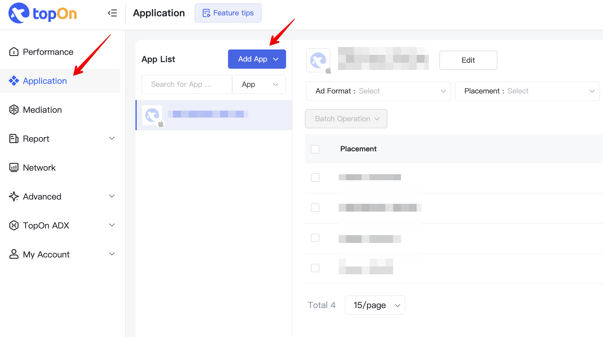
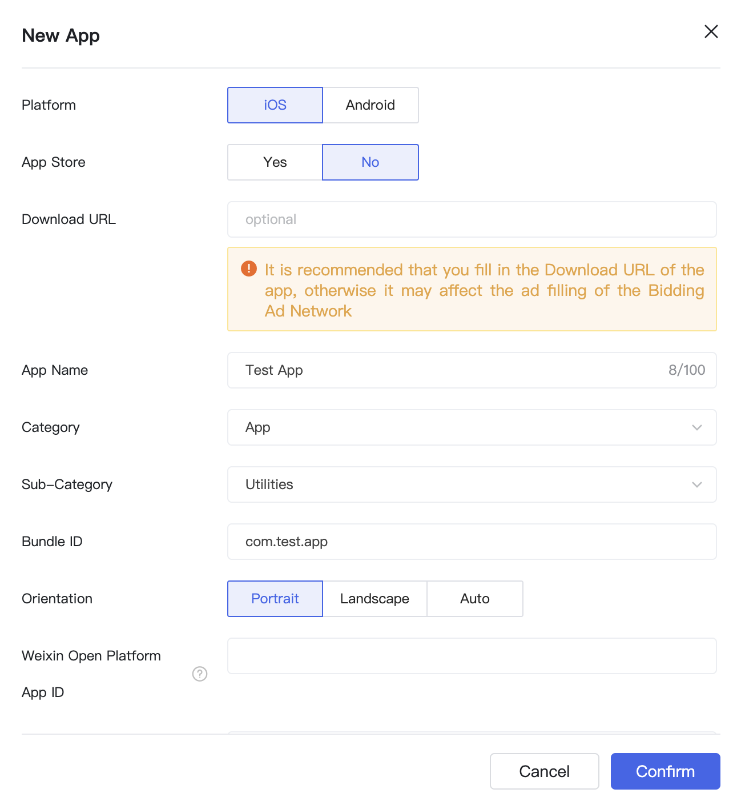
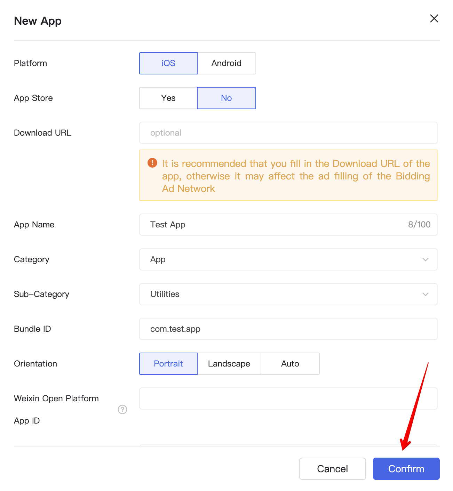
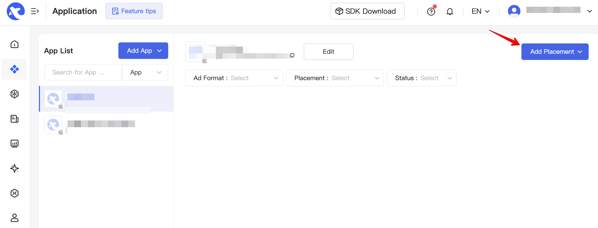
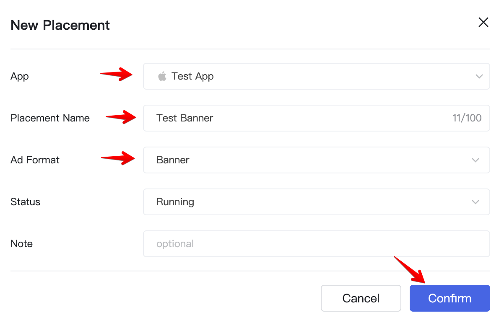
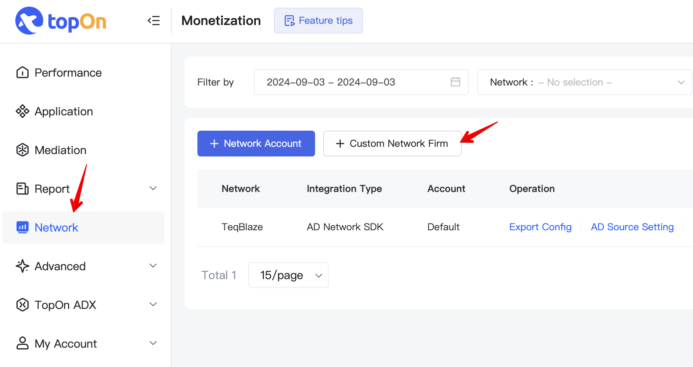
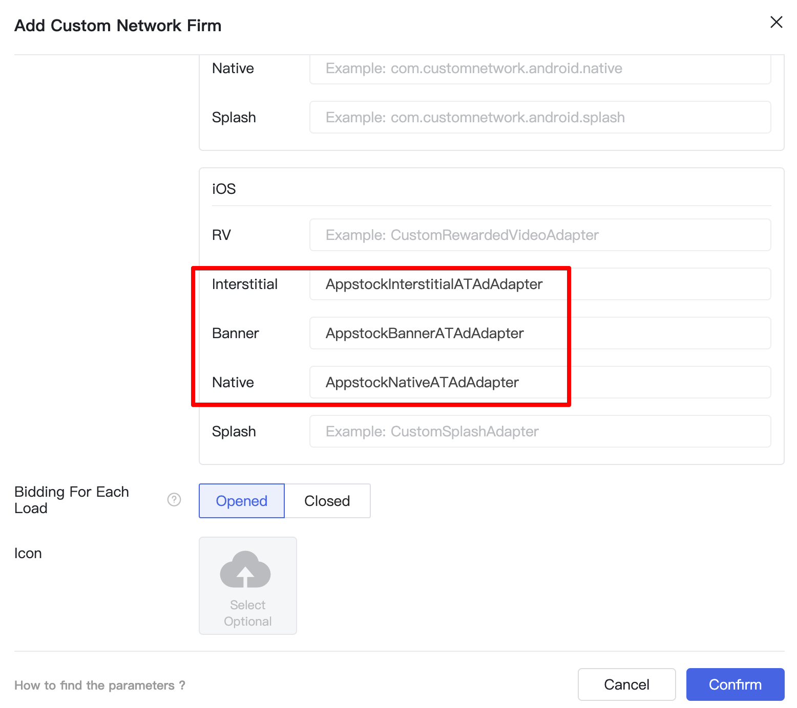
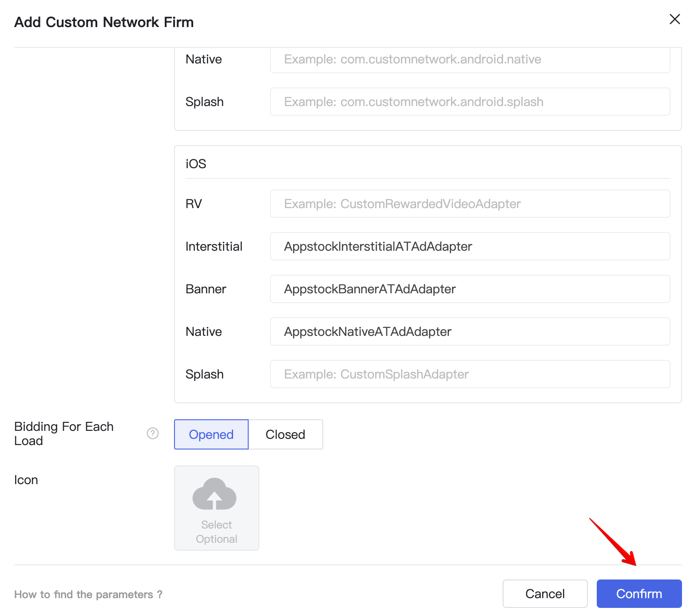
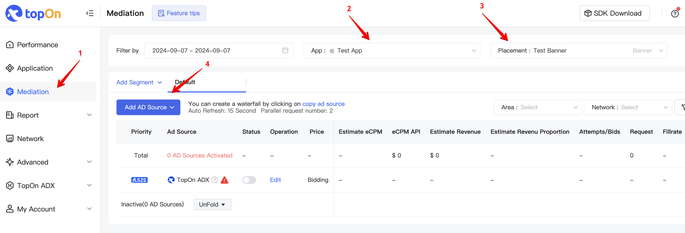
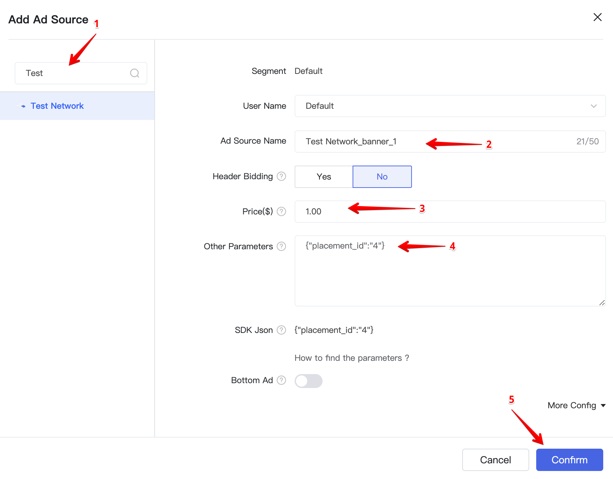

# Appstock SDK iOS - Mediation - TopOn

In order to integrate Appstock TopOn Adapter into your app, add the following lines to your Podfile:

```bash
pod 'AppstockSDK', '1.1.0'
pod 'AppstockTopOnAdapter', '1.1.0'
```

To integrate the Appstock SDK into your TopOn monetization stack, you should create an ad network and add it to the respective ad units.

1. Register an account at [toponad.com](https://www.toponad.com/en).
2. Create an app in TopOn dashborad. Select [[Application > Add app]](https://portal.toponad.com/m/app).



3. Fill the required information fields for your app. 



4. Click `Confirm`. 



5. Click `Add placement`.



6. Select the app. Fill `Placement name` and `Ad Format` fields.



7. Select `Network` and click `+ Custom Network Firm`. 



8. Fill `Network Firm Name`. Fill the adapter's class name: 

- Interstitial - `AppstockInterstitialATAdAdapter`;
- Banner - `AppstockBannerATAdAdapter`;
- Native - `AppstockNativeATAdAdapter`.



9. Click `Confirm`.



10. Open the `Mediation` tab, select the app and placement, click `Add AD source`.



11. Find the needed network. Add `Ad source name` and `Price`. Fill the `Custom Parameters` Custom parameters should contain a valid JSON with IDs (placement ID, endpoint ID) values that will be used by the adapter to load ads. Click `Confirm`.



## Native Ads

If you integrate native ads, you should pass the native assets through extras to the Appstock Adapter using `kAppstockNativeAssets` key in your app code:

**Swift**

```swift 
private func loadAd() {
    // 1. Configure the native parameters
    let image = AppstockNativeAssetImage(minimumWidth: 200, minimumHeight: 50, required: true)
    image.type = .Main
    
    let icon = AppstockNativeAssetImage(minimumWidth: 20, minimumHeight: 20, required: true)
    icon.type = .Icon
    
    let title = AppstockNativeAssetTitle(length: 90, required: true)
    let body = AppstockNativeAssetData(type: .description, required: true)
    let cta = AppstockNativeAssetData(type: .ctatext, required: true)
    let sponsored = AppstockNativeAssetData(type: .sponsored, required: true)
    
    let parameters = AppstockNativeParameters()
    parameters.assets = [title, icon, image, sponsored, body, cta]
    
    let eventTracker = AppstockNativeEventTracker(
        event: .Impression,
        methods: [.Image, .js]
    )
    
    parameters.eventtrackers = [eventTracker]
    parameters.context = .Social
    parameters.placementType = .FeedContent
    parameters.contextSubType = .Social
    
    // 2. Set up the extras
    let extra = [
        kAppstockNativeAssets: parameters
    ]
    
    // 3. Load the ad
    ATAdManager.shared().loadAD(
        withPlacementID: placementID,
        extra: extra,
        delegate: self
    )
}
```

*Objective-C*

```objc
- (void)loadAd {
    // 1. Configure the native parameters
    AppstockNativeAssetImage *image = [
        [AppstockNativeAssetImage alloc]
        initWithMinimumWidth:200
        minimumHeight:200
        required:true
    ];
    
    image.type = AppstockImageAsset.Main;
    
    AppstockNativeAssetImage *icon = [
        [AppstockNativeAssetImage alloc]
        initWithMinimumWidth:20
        minimumHeight:20
        required:true
    ];
    
    icon.type = AppstockImageAsset.Icon;
    
    AppstockNativeAssetTitle *title = [
        [AppstockNativeAssetTitle alloc]
        initWithLength:90
        required:true
    ];
    
    AppstockNativeAssetData *body = [
        [AppstockNativeAssetData alloc]
        initWithType:AppstockDataAssetDescription
        required:true
    ];
    
    AppstockNativeAssetData *cta = [
        [AppstockNativeAssetData alloc]
        initWithType:AppstockDataAssetCtatext
        required:true
    ];
    
    AppstockNativeAssetData *sponsored = [
        [AppstockNativeAssetData alloc]
        initWithType:AppstockDataAssetSponsored
        required:true
    ];
    
    AppstockNativeParameters * parameters = [AppstockNativeParameters new];
    parameters.assets = @[title, icon, image, sponsored, body, cta];
    
    AppstockNativeEventTracker * eventTracker = [
        [AppstockNativeEventTracker alloc]
        initWithEvent:AppstockEventType.Impression
        methods:@[AppstockEventTracking.Image, AppstockEventTracking.js]
    ];
    
    parameters.eventtrackers = @[eventTracker];
    parameters.context = AppstockContextType.Social;
    parameters.placementType = AppstockPlacementType.FeedContent;
    parameters.contextSubType = AppstockContextSubType.Social;
    
    // 2. Set up the extras
    NSDictionary *extra = @{
        kAppstockNativeAssets : parameters
    };
    
    // 3. Load the ad
    [[ATAdManager sharedManager] loadADWithPlacementID:self.placementID
                                                 extra:extra
                                              delegate:self];
}
```