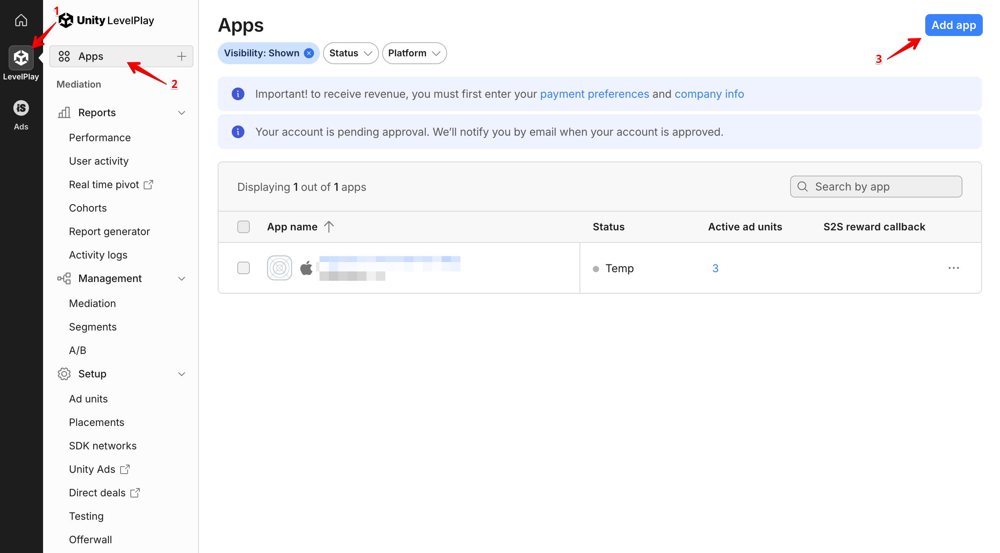
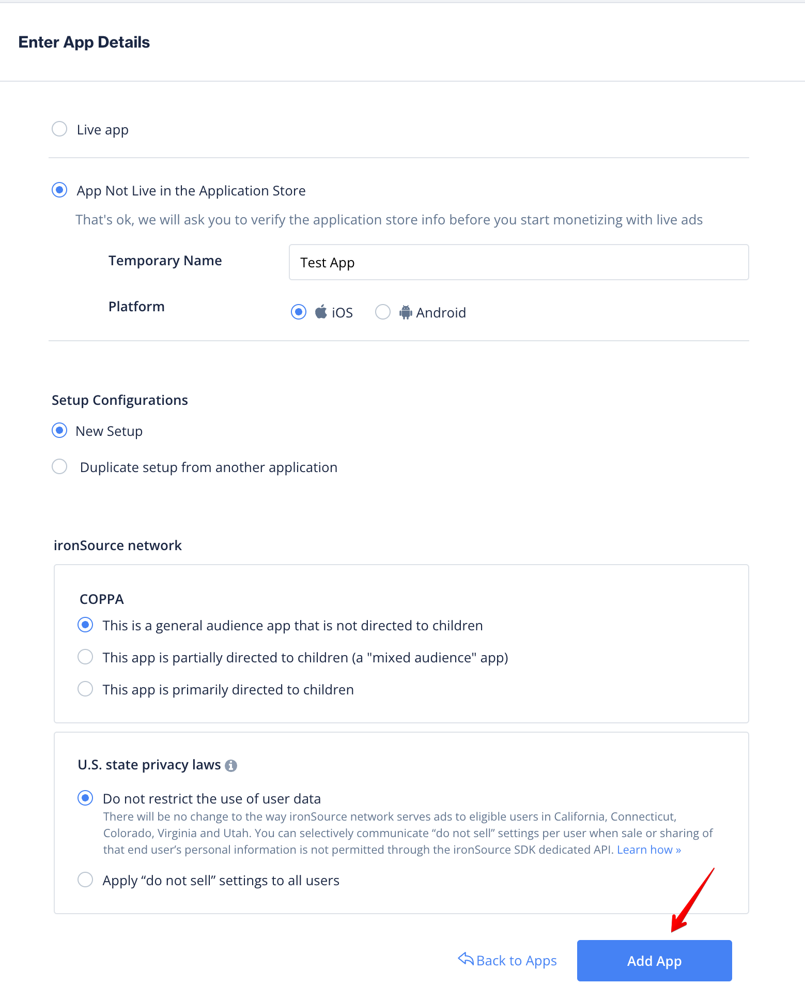
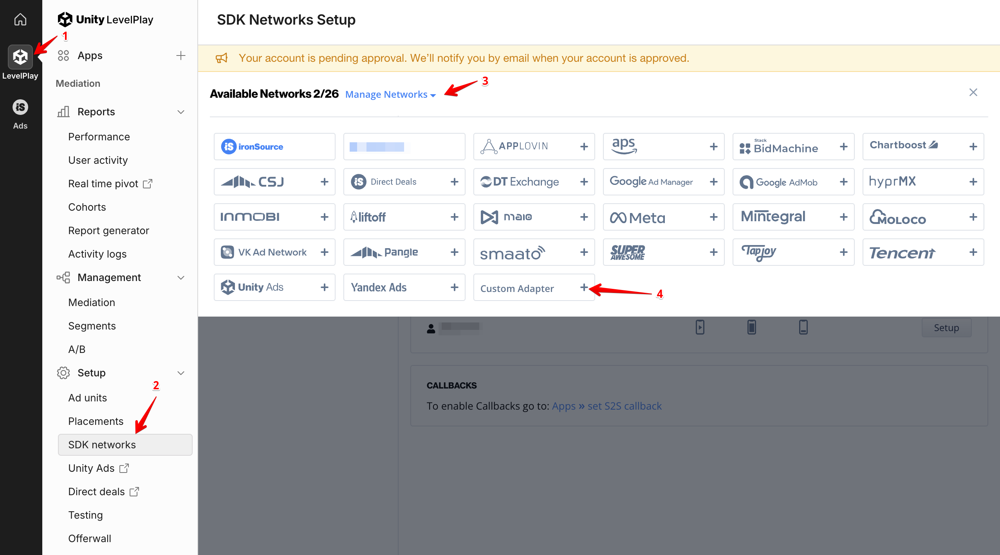
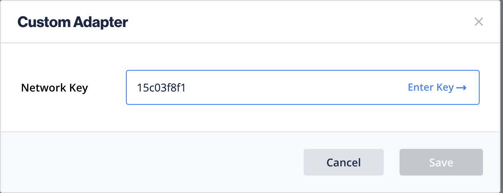
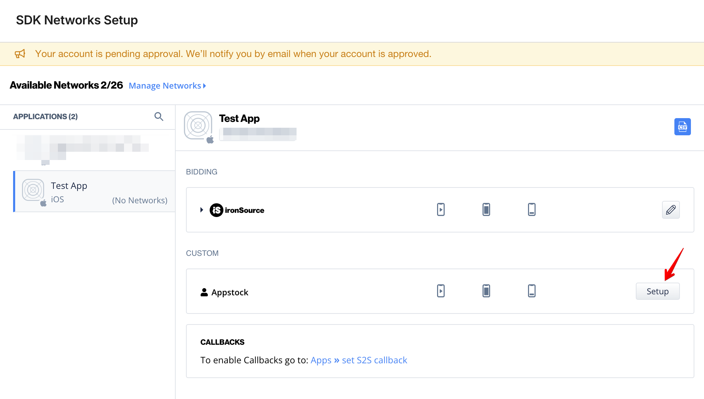
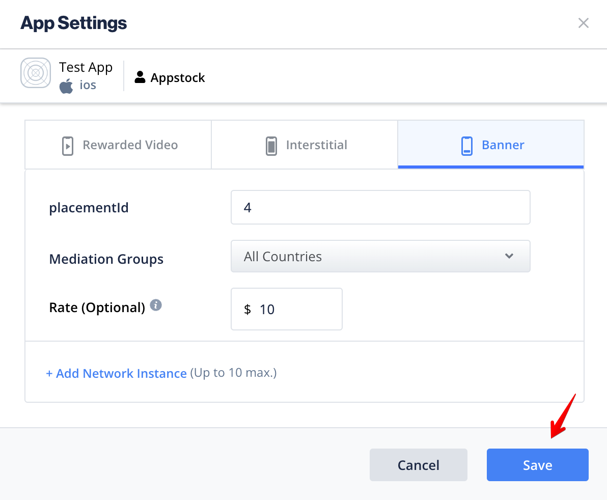

# Appstock SDK iOS - Mediation - ironSource

In order to integrate Appstock ironSource Adapter into your app, add the following lines to your Podfile:

```bash
pod 'AppstockSDK', '1.1.1'
pod 'AppstockIronSourceAdapter', '1.1.1'
```

To integrate the Appstock SDK into your ironSource monetization stack, you should create an ad network and add it to the respective ad units.

1. Sign in to your [IronSource account](https://platform.ironsrc.com).
2. Click **Apps** in the sidebar (**LevelPlay** -> **Apps**). Then click **Add app** .



3. Fill app details and click **Add app**.



4. Click **SDK networks** in the sidebar (**LevelPlay** -> **Setup** -> **SDK networks**). Click **Manage networks** and **Custom Adapter**.



5. Enter the network key `15c03f8f1` and click **Save**.



6. Fill your **partnerKey** for the Appstock platform and click **Save**.


7. Click **Setup** in the available networks list.



8. Create network instances for all placements you have in the Appstock platform. Fill **placementId**, **Mediation Groups** and **Rate** for desired type of the ad. Click **Save**.


