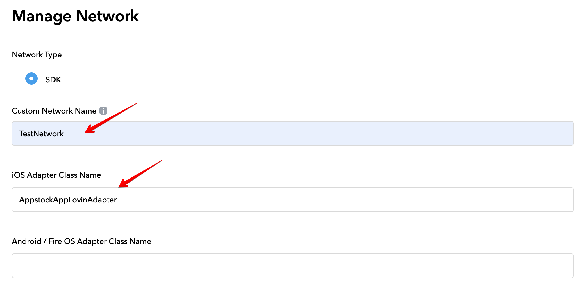

<details>
<summary># Appstock SDK iOS - Mediation - AdMob
</summary>

In order to integrate Appstock SDK into your app, add the following lines to your Podfile:

```bash
pod 'AppstockSDK', '1.0.0'
pod 'AppstockGoogleMobileAdsAdapter', '1.0.0'
```

In order to add Appstock to the waterfall, you need to create a custom event in your AdMob account and then add this event to the respective mediation groups.

To create a Appstock custom event, follow the instructions:

1. Sign in to your AdMob account at https://apps.admob.com.
2. Click **Mediation** in the sidebar.


3. Click the **Waterfall** sources tab. 


4. Click **Custom Event**.


5. Find your app in the list and click on it to expand.


6. Click **Add mapping**.


7. Click **Add mapping**. To include multiple custom events, you’ll need to set up [additional mappings](https://support.google.com/admob/answer/13395411#manage).


8. Add the mapping details, including a mapping name. Enter a class name (required) and a parameter (optional) for each ad unit. Typically, the optional parameter contains a JSON that contains IDs (placement ID, endpoint ID) that will be used by the custom event to load ads.

Parameters:

- **placement_id** - unique identifier generated on the platform's UI;
- **endpoint_id** - unique identifier generated on the platform's UI.

```json
{
  "placement_id": “4”
}
```


9. Click **Save**.


After you’ve finished setting up your custom event, you’re ready to add it to a mediation group. To add your ad source to an existing mediation group:

1. Sign in to your AdMob account at https://apps.admob.com.
2. Click **Mediation** in the sidebar.


3. In the **Mediation group** tab, click the name of the mediation group to which you're adding the ad source. 


4. In the Waterfall ad sources table, click **Add custom event**.


5. Enter a descriptive label for the event. Enter a manual eCPM to use for this custom event. The eCPM will be used to dynamically position the event in the mediation waterfall where it will compete with other ad sources to fill ad requests.


6. Click **Continue**.


7. Select an existing mapping to use for this custom event or click Add mapping to set up a new mapping. To use multiple custom events, you’ll have to [create an additional mapping](https://support.google.com/admob/answer/13395411#manage) for each custom event.


8. Click **Done**.


9. Click **Save**. The mediation group will be saved.


## Native Ads

If you integrate native ads, you should pass the native assets through Google Mobile Ads SDK (`GADAdLoader`) to the Appstock Adapter using `AppstockGADExtras` class in your app code:

*Swift*

```swift
private func loadAd() {
    // 1. Create a GADAdLoader
    adLoader = GADAdLoader(
        adUnitID: adUnitId,
        rootViewController: self,
        adTypes: [.native],
        options: []
    )
     
    // 2. Configure the GADAdLoader
    adLoader?.delegate = self
     
    // 3. Configure the native parameters
    let image = AppstockNativeAssetImage(minimumWidth: 200, 
    minimumHeight: 50, required: true)
    image.type = .Main
     
    let icon = AppstockNativeAssetImage(minimumWidth: 20, 
    minimumHeight: 20, required: true)
    icon.type = .Icon
     
    let title = AppstockNativeAssetTitle(length: 90, required: true)
    let body = AppstockNativeAssetData(type: .description, 
    required: true)
    let cta = AppstockNativeAssetData(type: .ctatext, required: true)
    let sponsored = AppstockNativeAssetData(type: .sponsored, 
    required: true)
     
    let parameters = AppstockNativeParameters()
    parameters.assets = [title, icon, image, sponsored, body, cta]
     
    let eventTracker = AppstockNativeEventTracker(
        event: .Impression,
        methods: [.Image, .js]
    )
     
    parameters.eventtrackers = [eventTracker]
    parameters.context = .Social
    parameters.placementType = .FeedContent
    parameters.contextSubType = .Social
     
    // 4. Create a AppstockGADExtras
    let extras = AppstockGADExtras(nativeParameters: parameters)
     
    // 5. Create a GADRequest
    let request = GADRequest()
     
    // 6. Register the AppstockGADExtras
    request.register(extras)
     
    // 7. Load the ad
    adLoader?.load(request)
}
```

*Objective-C*

```objc
- (void)loadAd {
    // 1. Create a GADAdLoader
    self.adLoader = [[GADAdLoader alloc] initWithAdUnitID:self.adUnitId
    rootViewController:self adTypes:@[GADAdLoaderAdTypeNative]
    options:@[]];
    
    // 2. Configure the GADAdLoader
    self.adLoader.delegate = self;
    
    // 3. Configure the native parameters
    AppstockNativeAssetImage *image = [
        [AppstockNativeAssetImage alloc]
        initWithMinimumWidth:200
        minimumHeight:200
        required:true
    ];
    
    image.type = AppstockImageAsset.Main;
    
    AppstockNativeAssetImage *icon = [
        [AppstockNativeAssetImage alloc]
        initWithMinimumWidth:20
        minimumHeight:20
        required:true
    ];
    
    icon.type = AppstockImageAsset.Icon;
    
    AppstockNativeAssetTitle *title = [
        [AppstockNativeAssetTitle alloc]
        initWithLength:90
        required:true
    ];
    
    AppstockNativeAssetData *body = [
        [AppstockNativeAssetData alloc]
        initWithType:AppstockDataAssetDescription
        required:true
    ];
    
    AppstockNativeAssetData *cta = [
        [AppstockNativeAssetData alloc]
        initWithType:AppstockDataAssetCtatext
        required:true
    ];
    
    AppstockNativeAssetData *sponsored = [
        [AppstockNativeAssetData alloc]
        initWithType:AppstockDataAssetSponsored
        required:true
    ];
    
    AppstockNativeParameters * parameters = 
    [AppstockNativeParameters new];
    parameters.assets = @[title, icon, image, sponsored, body, cta];
    
    AppstockNativeEventTracker * eventTracker = [
        [AppstockNativeEventTracker alloc]
        initWithEvent:AppstockEventType.Impression
        methods:@[AppstockEventTracking.Image, AppstockEventTracking.js]
    ];
    
    parameters.eventtrackers = @[eventTracker];
    parameters.context = AppstockContextType.Social;
    parameters.placementType = AppstockPlacementType.FeedContent;
    parameters.contextSubType = AppstockContextSubType.Social;
    
    // 4. Create a AppstockGADExtras
    AppstockGADExtras * extras = [[AppstockGADExtras alloc] 
    initWithNativeParameters:parameters];
    
    // 5. Create a GADRequest
    GADRequest * request = [GADRequest new];
    
    // 6. Register the AppstockGADExtras
    [request registerAdNetworkExtras:extras];
    
    // 7. Load the ad
    [self.adLoader loadRequest:request];
}
```

Display the ad as described in [AdMob docs](https://developers.google.com/admob/ios/native/advanced):

*Swift*

```swift
func adLoader(_ adLoader: GADAdLoader, didReceive nativeAd: GADNativeAd) {
    // Set GADNativeAd in GADNativeAdView
    admobNativeView.nativeAd = nativeAd
    
    // 8. Render the ad
    titleLabel.text = nativeAd.headline
    bodyLabel.text = nativeAd.body
    
    mainImageView.setImage(
        from: nativeAd.images?.last?.imageURL?.absoluteString,
        placeholder: UIImage(systemName: "photo.artframe")
    )
    
    iconView.setImage(
        from: nativeAd.icon?.imageURL?.absoluteString,
        placeholder: UIImage(systemName: "photo.artframe")
    )
    
    callToActionButton.setTitle(nativeAd.callToAction, for: .normal)
    sponsoredLabel.text = nativeAd.advertiser
}
```

*Objective-C*

```objc
- (void)adLoader:(GADAdLoader *)adLoader didReceiveNativeAd:(GADNativeAd *)nativeAd {
    // Set GADNativeAd in GADNativeAdView
    self.admobNativeView.nativeAd = nativeAd;
    
    self.titleLabel.text = nativeAd.headline;
    self.bodyLabel.text = nativeAd.body;
    self.sponsoredLabel.text = nativeAd.advertiser;
    
    [self.mainImageView setImageFromURLString:nativeAd.images.lastObject.imageURL.absoluteString
                                      placeholder:[UIImage systemImageNamed:@"photo.artframe"]];
    [self.iconView setImageFromURLString:nativeAd.icon.imageURL.absoluteString
                                      placeholder:[UIImage systemImageNamed:@"photo.artframe"]];
    [self.callToActionButton setTitle:nativeAd.callToAction forState:UIControlStateNormal];
}
```
</details>
<details>
<summary># Appstock SDK iOS - Mediation - AppLovin
</summary>


In order to integrate Appstock SDK into your app, add following lines to your Podfile:

```bash
pod 'AppstockSDK', '1.0.0'
pod 'AppstockAppLovinMAXAdapter', '1.0.0'
```

To integrate the Appstock SDK into your AppLovin monetization stack, you should enable a Appstock SDK ad network and add it to the respective ad units.

1. In the MAX Dashboard, select [MAX > Mediation > Manage > Networks](https://dash.applovin.com/o/mediation/networks/).


2. Click **Click here to add a Custom Network at the bottom of the page**. The **Create Custom Network** page appears.

3. Add the information about your custom network:
- **Network Type** : Choose **SDK**.
- **Name** : Appstock.
- **iOS Adapter Class Name** : AppstockAppLovinAdapter




4. Open [MAX > Mediation > Manage > Ad Units](https://dash.applovin.com/o/mediation/ad_units/) in the MAX dashboard.


5. Search and select an ad unit for which you want to add the custom SDK network that you created in the previous step.


6. Select which custom network you want to enable and enter the information for each placement. Refer to the network documentation to see what values you need to set for the **App ID**, **Placement ID**, and **Custom Parameters**.


Typically, the custom parameters field should contain a JSON that contains IDs (placement ID, endpoint ID) that will be used to load ads.

Parameters:

- **placement_id** - unique identifier generated on the platform's UI;
- **endpoint_id** - unique identifier generated on the platform's UI.

Example: 

```json
{
  "placement_id": “4”
}
```

7. Save ad unit.

## Native Ads

If you integrate native ads, you should pass the native assets through AppLovin MAX SDK (`MANativeAdLoader`) to the Appstock Adapter using `AppstockAppLovinExtras` class in your app code:

*Swift*

```swift
private func loadAd() {
    // 1. Create a MANativeAdLoader
    nativeAdLoader = MANativeAdLoader(adUnitIdentifier: adUnitId)
     
    // 2. Configure the MANativeAdLoader
    nativeAdLoader.nativeAdDelegate = self
     
    // 3. Configure the native parameters
    let image = AppstockNativeAssetImage(minimumWidth: 200, 
    minimumHeight: 50, required: true)
    image.type = .Main
     
    let icon = AppstockNativeAssetImage(minimumWidth: 20, 
    minimumHeight: 20, required: true)
    icon.type = .Icon
     
    let title = AppstockNativeAssetTitle(length: 90, required: true)
    let body = AppstockNativeAssetData(type: .description, 
    required: true)
    let cta = AppstockNativeAssetData(type: .ctatext, 
    required: true)
    let sponsored = AppstockNativeAssetData(type: .sponsored, 
    required: true)
     
    let parameters = AppstockNativeParameters()
    parameters.assets = [title, icon, image, sponsored, body, cta]
     
    let eventTracker = AppstockNativeEventTracker(
        event: .Impression,
        methods: [.Image, .js]
    )
     
    parameters.eventtrackers = [eventTracker]
    parameters.context = .Social
    parameters.placementType = .FeedContent
    parameters.contextSubType = .Social
     
    // 4. Create a AppstockAppLovinExtras
    let extras = AppstockAppLovinExtras(nativeParameters: parameters)
     
    // 5. Set local extra parameter
    nativeAdLoader.setLocalExtraParameterForKey(
    AppstockAppLovinExtras.key, value: extras)
     
    // 6. Load the ad
    nativeAdLoader.loadAd(into: maNativeAdView)
}
```

*Objective-C*

```objc
- (void)loadAd {
    // 1. Create a MANativeAdLoader
    self.nativeAdLoader = [[MANativeAdLoader alloc] 
    initWithAdUnitIdentifier:self.adUnitId];
    
    // 2. Configure the MANativeAdLoader
    self.nativeAdLoader.nativeAdDelegate = self;
    
    // 3. Configure the native parameters
    AppstockNativeAssetImage *image = [
        [AppstockNativeAssetImage alloc]
        initWithMinimumWidth:200
        minimumHeight:200
        required:true
    ];
    
    image.type = AppstockImageAsset.Main;
    
    AppstockNativeAssetImage *icon = [
        [AppstockNativeAssetImage alloc]
        initWithMinimumWidth:20
        minimumHeight:20
        required:true
    ];
    
    icon.type = AppstockImageAsset.Icon;
    
    AppstockNativeAssetTitle *title = [
        [AppstockNativeAssetTitle alloc]
        initWithLength:90
        required:true
    ];
    
    AppstockNativeAssetData *body = [
        [AppstockNativeAssetData alloc]
        initWithType:AppstockDataAssetDescription
        required:true
    ];
    
    AppstockNativeAssetData *cta = [
        [AppstockNativeAssetData alloc]
        initWithType:AppstockDataAssetCtatext
        required:true
    ];
    
    AppstockNativeAssetData *sponsored = [
        [AppstockNativeAssetData alloc]
        initWithType:AppstockDataAssetSponsored
        required:true
    ];
    
    AppstockNativeParameters * parameters = 
    [AppstockNativeParameters new];
    parameters.assets = @[title, icon, image, sponsored, body, cta];
    
    AppstockNativeEventTracker * eventTracker = [
        [AppstockNativeEventTracker alloc]
        initWithEvent:AppstockEventType.Impression
        methods:@[AppstockEventTracking.Image, AppstockEventTracking.js]
    ];
    
    parameters.eventtrackers = @[eventTracker];
    parameters.context = AppstockContextType.Social;
    parameters.placementType = AppstockPlacementType.FeedContent;
    parameters.contextSubType = AppstockContextSubType.Social;
    
    // 4. Create a AppstockAppLovinExtras
    AppstockAppLovinExtras * extras = [[AppstockAppLovinExtras alloc] 
    initWithNativeParameters: parameters];
    
    // 5. Set local extra parameter
    [self.nativeAdLoader 
    setLocalExtraParameterForKey:AppstockAppLovinExtras.key value:extras];
    
    // 6. Load the ad
    [self.nativeAdLoader loadAdIntoAdView:self.maNativeAdView];
}
```

Make sure you've bound the subviews using unique tag IDs with an instance of `MANativeAdViewBinder` as described in [AppLovin MAX docs](https://developers.applovin.com/en/ios/ad-formats/native-ads/#:~:text=Ad%20Unit%20screen%3A-,Bind%20UI%20Components,-You%20can%20bind):

*Swift*

```swift
   // Bind the subviews using unique tag IDs with an instance of MANativeAdViewBinder
    let binder = MANativeAdViewBinder { builder in
        builder.iconImageViewTag = 1
        builder.titleLabelTag = 2
        builder.bodyLabelTag = 3
        builder.advertiserLabelTag = 4
        builder.callToActionButtonTag = 5
    }
    
    maNativeAdView.bindViews(with: binder)
```

*Objective-C*

```objc
MANativeAdViewBinder * binder = [
    [MANativeAdViewBinder alloc]
    initWithBuilderBlock:^(MANativeAdViewBinderBuilder * _Nonnull builder) {
        builder.iconImageViewTag = 1;
        builder.titleLabelTag = 2;
        builder.bodyLabelTag = 3;
        builder.advertiserLabelTag = 4;
        builder.callToActionButtonTag = 5;
    }
];
```
</details>


<details>
<summary># Appstock SDK iOS - Mediation - TopOn</summary>


In order to integrate Appstock TopOn Adapter into your app, add the following lines to your Podfile:

```bash
pod 'AppstockSDK', '1.0.1'
pod 'AppstockTopOnAdapter', '1.0.1'
```

To integrate the Appstock SDK into your TopOn monetization stack, you should create an ad network and add it to the respective ad units.

1. Register an account at [toponad.com](https://www.toponad.com/en).
2. Create an app in TopOn dashborad. Select [[Application > Add app]](https://portal.toponad.com/m/app).


3. Fill the required information fields for your app. 


4. Click `Confirm`. 


5. Click `Add placement`.


6. Select the app. Fill `Placement name` and `Ad Format` fields.


7. Select `Network` and click `+ Custom Network Firm`. 


8. Fill `Network Firm Name`. Fill the adapter's class name: 

- Interstitial - `AppstockInterstitialATAdAdapter`;
- Banner - `AppstockBannerATAdAdapter`;
- Native - `AppstockNativeATAdAdapter`.


9. Click `Confirm`.


10. Open the `Mediation` tab, select the app and placement, click `Add AD source`.


11. Find the needed network. Add `Ad source name` and `Price`. Fill the `Custom Parameters` Custom parameters should contain a valid JSON with IDs (placement ID, endpoint ID) values that will be used by the adapter to load ads. Click `Confirm`.


## Native Ads

If you integrate native ads, you should pass the native assets through extras to the Appstock Adapter using `kAppstockNativeAssets` key in your app code:

**Swift**

```swift 
private func loadAd() {
    // 1. Configure the native parameters
    let image = AppstockNativeAssetImage(minimumWidth: 200, minimumHeight: 50, required: true)
    image.type = .Main
    
    let icon = AppstockNativeAssetImage(minimumWidth: 20, minimumHeight: 20, required: true)
    icon.type = .Icon
    
    let title = AppstockNativeAssetTitle(length: 90, required: true)
    let body = AppstockNativeAssetData(type: .description, required: true)
    let cta = AppstockNativeAssetData(type: .ctatext, required: true)
    let sponsored = AppstockNativeAssetData(type: .sponsored, required: true)
    
    let parameters = AppstockNativeParameters()
    parameters.assets = [title, icon, image, sponsored, body, cta]
    
    let eventTracker = AppstockNativeEventTracker(
        event: .Impression,
        methods: [.Image, .js]
    )
    
    parameters.eventtrackers = [eventTracker]
    parameters.context = .Social
    parameters.placementType = .FeedContent
    parameters.contextSubType = .Social
    
    // 2. Set up the extras
    let extra = [
        kAppstockNativeAssets: parameters
    ]
    
    // 3. Load the ad
    ATAdManager.shared().loadAD(
        withPlacementID: placementID,
        extra: extra,
        delegate: self
    )
}
```

*Objective-C*

```objc
- (void)loadAd {
    // 1. Configure the native parameters
    AppstockNativeAssetImage *image = [
        [AppstockNativeAssetImage alloc]
        initWithMinimumWidth:200
        minimumHeight:200
        required:true
    ];
    
    image.type = AppstockImageAsset.Main;
    
    AppstockNativeAssetImage *icon = [
        [AppstockNativeAssetImage alloc]
        initWithMinimumWidth:20
        minimumHeight:20
        required:true
    ];
    
    icon.type = AppstockImageAsset.Icon;
    
    AppstockNativeAssetTitle *title = [
        [AppstockNativeAssetTitle alloc]
        initWithLength:90
        required:true
    ];
    
    AppstockNativeAssetData *body = [
        [AppstockNativeAssetData alloc]
        initWithType:AppstockDataAssetDescription
        required:true
    ];
    
    AppstockNativeAssetData *cta = [
        [AppstockNativeAssetData alloc]
        initWithType:AppstockDataAssetCtatext
        required:true
    ];
    
    AppstockNativeAssetData *sponsored = [
        [AppstockNativeAssetData alloc]
        initWithType:AppstockDataAssetSponsored
        required:true
    ];
    
    AppstockNativeParameters * parameters = [AppstockNativeParameters new];
    parameters.assets = @[title, icon, image, sponsored, body, cta];
    
    AppstockNativeEventTracker * eventTracker = [
        [AppstockNativeEventTracker alloc]
        initWithEvent:AppstockEventType.Impression
        methods:@[AppstockEventTracking.Image, AppstockEventTracking.js]
    ];
    
    parameters.eventtrackers = @[eventTracker];
    parameters.context = AppstockContextType.Social;
    parameters.placementType = AppstockPlacementType.FeedContent;
    parameters.contextSubType = AppstockContextSubType.Social;
    
    // 2. Set up the extras
    NSDictionary *extra = @{
        kAppstockNativeAssets : parameters
    };
    
    // 3. Load the ad
    [[ATAdManager sharedManager] loadADWithPlacementID:self.placementID
                                                 extra:extra
                                              delegate:self];
}
```
    
[self.maNativeAdView bindViewsWithAdViewBinder:binder];

</details>


<details>
<summary># Appstock SDK iOS - Mediation - ironSource</summary>

In order to integrate Appstock ironSource Adapter into your app, add the following lines to your Podfile:

```bash
pod 'AppstockSDK', '1.0.2'
pod 'AppstockIronSourceAdapter', '1.0.2'
```

To integrate the Appstock SDK into your ironSource monetization stack, you should create an ad network and add it to the respective ad units.

1. Sign in to your [IronSource account](https://platform.ironsrc.com).
2. Click **Apps** in the sidebar (**LevelPlay** -> **Apps**). Then click **Add app** .


3. Fill app details and click **Add app**.


4. Click **SDK networks** in the sidebar (**LevelPlay** -> **Setup** -> **SDK networks**). Click **Manage networks** and **Custom Adapter**.


5. Enter the network key `15c03f8f1` and click **Save**.


6. Fill your **partnerKey** for the Appstock platform and click **Save**.


7. Click **Setup** in the available networks list.


8. Create network instances for all placements you have in the Appstock platform. Fill **placementId**, **Mediation Groups** and **Rate** for desired type of the ad. Click **Save**.


</details>
